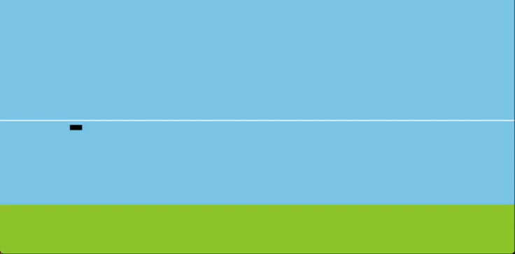

# bluesky-gym
A gymnasium style environment for standardized Reinforcement Learning research in Air Traffic Management.
Build on the BlueSky Air Traffic Simulator 

## The environments

### Altitude Control

```python
env = gymnasium.make("DescendEnv-v0")
```

In this environment, the agent controls the altitude of the aircraft through vertical velocity commands. The goal of the agent is to stay at a randomly generated target altitude for as long as possible, before initiating the descend towards the runway. 

Deviating from the target altitude, or being too high when the runway has approach is penalized. Additionally landing too early, e.g. crashing, is also penalized.

Fairly untrained policy operating in DescendEnv-v0. |Trained policy operating in DescendEnv-v0.
:--------------------------------------------------:|:--------------------------------------------------:
                |   

