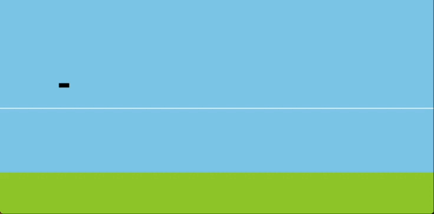

# bluesky-gym
A gymnasium style environment for standardized Reinforcement Learning research in Air Traffic Management.
Build on the BlueSky Air Traffic Simulator 

## The environments

### Altitude Control

```python
env = gymnasium.make("DescentEnv-v0")
```

In this environment, the agent controls the altitude of the aircraft through vertical velocity commands. The goal of the agent is to stay at a randomly generated target altitude for as long as possible, before initiating the descend towards the runway. 

Deviating from the target altitude, or being too high when the runway has approached is penalized. Additionally landing too early, e.g. crashing, is also penalized.

Fairly untrained policy operating in DescentEnv-v0. |Trained policy operating in DescentEnv-v0.
:--------------------------------------------------:|:--------------------------------------------------:
                |   

### Horizontal Control - Real Time Waypoint Planning

```python
env = gymnasium.make("PlanWaypointEnv-v0")
```

In this environment, the agent controls the heading of the aircraft. The goal of the agent is to visit as many waypoints as possible, by efficiently planning a path through all unvisited waypoints. 

For each unique waypoint visited, the agent is rewarded. After visiting a waypoint it becomes inactive, no longer giving rewards for visiting.

Fairly untrained policy operating in PlanWaypointEnv-v0. | Slightly better trained policy operating in PlanWaypointEnv-v0.
:--------------------------------------------------:|:--------------------------------------------------:
                |   


